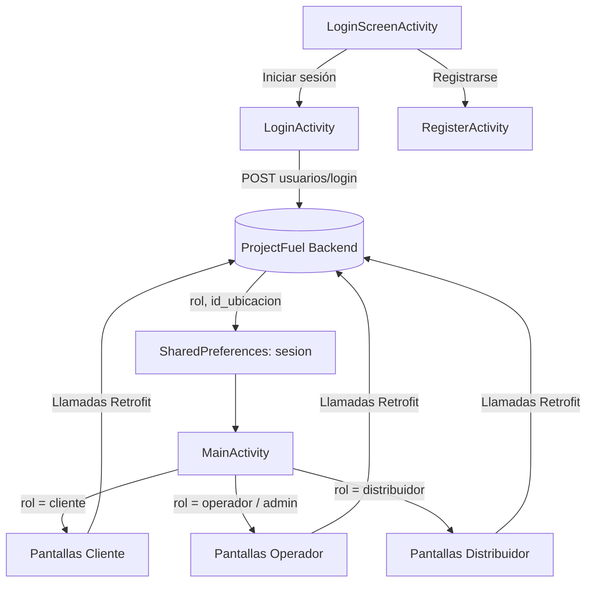

# ProjectFuel Frontend

Cliente Android nativo de **ProjectFuel**, una plataforma de gestión de una red de distribución de combustible desarrollada como proyecto de software para la Universidad Piloto de Colombia. La aplicación ofrece tres experiencias basadas en roles —cliente, operador de estación y distribuidor— sobre una única base de código, consumiendo la API REST de [ProjectFuel Backend](https://github.com/juandiegogalindo/ProjectFuel-Backend).


## Tabla de Contenidos

- [Descripción General](#descripción-general)
- [Roles y Funcionalidades](#roles-y-funcionalidades)
- [Arquitectura](#arquitectura)
- [Stack Tecnológico](#stack-tecnológico)
- [Inventario de Pantallas](#inventario-de-pantallas)
- [Integración con la API](#integración-con-la-api)
- [Prerrequisitos](#prerrequisitos)
- [Instalación y Puesta en Marcha](#instalación-y-puesta-en-marcha)
- [Configuración](#configuración)
- [Estructura del Proyecto](#estructura-del-proyecto)
- [Pruebas](#pruebas)
- [Limitaciones Conocidas](#limitaciones-conocidas)
- [Roadmap](#roadmap)
- [Contribuciones](#contribuciones)
- [Licencia](#licencia)
- [Autor](#autor)

## Descripción General

ProjectFuel Frontend es la cara móvil de un sistema de cadena de suministro de combustible: permite a los clientes buscar y consultar precios de combustible, a los operadores de estación gestionar el día a día de inventario y precios, y a los distribuidores administrar pedidos de entrega y rutas. El paquete y el nombre internos de la app (`co.edu.unipiloto.scrumbacklog`, `ScrumBacklog`) reflejan su origen como proyecto académico basado en Scrum; la lógica de dominio, en cambio, está completamente orientada a la distribución de combustible.

La aplicación no se distribuye en builds separados por rol. En su lugar, `MainActivity` lee el rol devuelto por el backend al iniciar sesión y muestra u oculta cada funcionalidad según corresponda, de modo que un mismo APK sirve tanto a clientes como a operadores y distribuidores.

## Roles y Funcionalidades

| Rol | Capacidades |
|---|---|
| **Cliente** | Consultar precios de combustible por ciudad/zona (`ConsultaActivity`), revisar horarios de atención de estaciones (`HorariosActivity`), ubicar estaciones en un mapa con trazado de ruta en tiempo real (`MapaEstacionesActivity`), validar códigos de subsidio (`SubsidioActivity`) |
| **Operador** (estación de servicio) | Registrar entradas y salidas de inventario (`InventarioActivity`, `SalidasActivity`), recibir despachos de combustible entrantes (`RecepcionCombustibleActivity`), ajustar precios por ubicación o zona (`ReguladorPreciosActivity`), programar nuevos pedidos (`ProgramarPedidoActivity`), revisar pedidos cancelados (`PedidosCanceladosActivity`), consultar el historial operativo (`HistorialOperadorActivity`), recibir alertas de inventario bajo (`NotificadorActivity`) |
| **Distribuidor** | Gestionar el inventario de distribución (`ControlInventarioActivity`), revisar pedidos pendientes y por entregar (`PedidosPendientesActivity`, `PedidosAEntregarActivity`), rastrear una ruta de entrega en vivo sobre el mapa (`RutaDistribucionActivity`), consultar el historial de entregas (`HistoricoDistribuidorActivity`), visualizar métricas agregadas de pedidos —pendientes, aceptados, entregados, cancelados, galones totales— en un dashboard (`DashboardDistribuidorActivity`) |
| **Admin** | Subconjunto de pantallas de operador (consulta de estaciones, inventario, alertas y control de inventario) |

Todas las pantallas (excepto login/registro) comparten un `Toolbar` común con una acción de información y una acción de cierre de sesión que limpia la sesión local y regresa a la pantalla de login.

## Arquitectura

La aplicación sigue una estructura simple de **una Activity por pantalla**, sin capa de ViewModel/Repository: cada `Activity` gestiona directamente sus propias vistas, invoca `ApiService` a través de Retrofit y actualiza la interfaz desde el callback de la respuesta. Las pantallas con listas usan implementaciones de `BaseAdapter` (por ejemplo `HistoricoAdapter`, `PedidoAdapter`, `MovimientoAdapter`) enlazadas a `ListView`, no a `RecyclerView`.



Dos pantallas (`MapaEstacionesActivity`, `RutaDistribucionActivity`) combinan además `FusedLocationProviderClient` para el rastreo GPS en vivo con la API de Directions de Google Maps, decodificando la polyline recibida con Android Maps Utils para dibujar rutas sobre el mapa.

## Stack Tecnológico

| Categoría | Tecnología |
|---|---|
| Lenguaje | Java 11 |
| Plataforma | Android, `minSdk` 23, `targetSdk`/`compileSdk` 36 |
| Build | Gradle 9.2.1 (Groovy DSL) con catálogo de versiones (`libs.versions.toml`); toolchain del daemon de Gradle fijado a JDK 21 |
| Networking | Retrofit 2.11.0 + convertidor Gson, interceptor de logging de OkHttp |
| Mapas y ubicación | Google Maps SDK for Android, Google Play Services Location, API de Directions de Google Maps (vía Volley), Android Maps Utils |
| UI | AndroidX AppCompat, Material Components, ConstraintLayout, View Binding |
| Persistencia local | `SharedPreferences` (sesión: id de usuario, rol, id de estación) |
| Pruebas | JUnit 4, AndroidX Test, Espresso (solo scaffolding por defecto) |

## Inventario de Pantallas

<details>
<summary>Listado completo de las 21 Activities</summary>

| Paquete | Activity | Propósito |
|---|---|---|
| `logIn` | `LoginScreenActivity` | Punto de entrada de la app / launcher activity |
| `logIn` | `LoginActivity` | Autentica y almacena los datos de sesión |
| `logIn` | `RegisterActivity` | Auto-registro de clientes |
| — | `MainActivity` | Centro de navegación basado en rol |
| `cliente` | `ConsultaActivity` | Consulta de precios de combustible por ubicación/zona |
| `cliente` | `HorariosActivity` | Horarios de atención de estaciones |
| `cliente` | `MapaEstacionesActivity` | Mapa de estaciones + ruta hacia la estación seleccionada |
| `cliente` | `SubsidioActivity` | Validación de códigos de subsidio |
| `operador` | `InventarioActivity` | Registro de entradas de inventario |
| `operador` | `SalidasActivity` | Registro de salidas de inventario |
| `operador` | `RecepcionCombustibleActivity` | Recepción de despachos de combustible programados |
| `operador` | `ReguladorPreciosActivity` | Ajuste de precios por ubicación/zona |
| `operador` | `ProgramarPedidoActivity` | Programación de un nuevo pedido |
| `operador` | `PedidosCanceladosActivity` | Revisión de pedidos cancelados |
| `operador` | `HistorialOperadorActivity` | Historial de movimientos operativos |
| `operador` | `NotificadorActivity` | Verificación de alertas de inventario bajo |
| `distribuidor` | `ControlInventarioActivity` | Control de inventario de distribución |
| `distribuidor` | `PedidosPendientesActivity` | Cola de pedidos pendientes |
| `distribuidor` | `PedidosAEntregarActivity` | Pedidos listos para entrega |
| `distribuidor` | `RutaDistribucionActivity` | Rastreo de ruta de entrega en vivo |
| `distribuidor` | `HistoricoDistribuidorActivity` | Historial de entregas |
| `distribuidor` | `DashboardDistribuidorActivity` | Dashboard de métricas de pedidos |

</details>

## Integración con la API

Toda la comunicación con el backend se realiza a través de la interfaz Retrofit `ApiService`. Principales grupos de endpoints consumidos:

| Dominio | Endpoints |
|---|---|
| Autenticación | `POST /usuarios/login`, `POST /usuarios/registro` |
| Ubicaciones | `GET /ubicaciones`, `GET /ubicaciones/ciudades`, `GET /ubicaciones/zonas/{ciudad}` |
| Precios | `GET/PUT /precios/ubicacion`, `GET/PUT /precios/zona` |
| Inventario | `GET /inventarios/ubicacion/{idUbicacion}` |
| Movimientos | `POST /movimientos/entrada`, `POST /movimientos/salida`, `GET /movimientos/ubicacion/{idUbicacion}` |
| Pedidos | `POST /pedidos`, `GET /pedidos`, `GET /pedidos/pendientes(/{idUbicacion})`, `GET /pedidos/aceptados`, `GET /pedidos/cancelados`, `GET /pedidos/entregados/{idUbicacion}`, `PUT /pedidos/{id}/aceptar`, `PUT /pedidos/{id}/cancelar`, `PUT /pedidos/{id}/recibir`, `PUT /pedidos/{id}/entregar`, `GET /pedidos/dashboard/distribuidor` |
| Combustibles | `GET /combustibles` |
| Subsidios | `POST /subsidios/validar` |

El endpoint de Directions usado para trazar rutas de conducción (`maps.googleapis.com/maps/api/directions/json`) se invoca por separado con Volley, fuera del stack de `ApiService`/Retrofit.

## Prerrequisitos

- Android Studio (Ladybug o superior, compatible con AGP 9.0.1 / compileSdk 36)
- JDK 21 (toolchain del daemon de Gradle) — JDK 11 se usa únicamente como compatibilidad de código fuente/target del módulo de la app
- Un emulador de Android o dispositivo físico, API nivel 23 o superior
- Una instancia en ejecución de [ProjectFuel Backend](https://github.com/juandiegogalindo/ProjectFuel-Backend) accesible desde la red del dispositivo/emulador
- Una clave de API de Google Maps con **Maps SDK for Android** y **Directions API** habilitadas

## Instalación y Puesta en Marcha

```bash
git clone https://github.com/juandiegogalindo/ProjectFuel-Frontend.git
cd ProjectFuel-Frontend
```

Abrir el proyecto en Android Studio y dejar que Gradle sincronice, o compilar desde la línea de comandos:

```bash
./gradlew assembleDebug
```

Instalar en un dispositivo/emulador conectado:

```bash
./gradlew installDebug
```

## Configuración

Antes de usar la app contra tu propio entorno, hay que ajustar dos valores:

**1. URL base del backend**, definida de forma fija en `ApiClient.java`:

```java
// app/src/main/java/co/edu/unipiloto/scrumbacklog/api/apiconfiguracion/ApiClient.java
private static final String BASE_URL = "http://192.168.2.10:8080/";
```

Debe apuntarse a donde esté corriendo tu instancia del backend. Para un emulador que se conecta a un backend en la misma máquina anfitriona, `10.0.2.2` es la dirección de loopback convencional en lugar de `localhost`.

**2. Clave de API de Google Maps**, actualmente duplicada en tres lugares: `res/values/strings.xml`, `AndroidManifest.xml`, y un string literal dentro de la URL de la petición Directions en `MapaEstacionesActivity.java`. Se debe reemplazar en los tres sitios por una clave propia (ver [Limitaciones Conocidas](#limitaciones-conocidas) para entender por qué no debería quedar fija en el código).

## Estructura del Proyecto

```
ProjectFuel-Frontend/
├── app/
│   ├── src/main/java/co/edu/unipiloto/scrumbacklog/
│   │   ├── activity/
│   │   │   ├── logIn/          # LoginScreenActivity, LoginActivity, RegisterActivity
│   │   │   ├── cliente/        # Consulta, Horarios, MapaEstaciones, Subsidio
│   │   │   ├── operador/       # Inventario, Salidas, Notificador, ReguladorPrecios,
│   │   │   │                   # ProgramarPedido, PedidosCancelados,
│   │   │   │                   # RecepcionCombustible, HistorialOperador (+ adapters)
│   │   │   ├── distribuidor/   # ControlInventario, DashboardDistribuidor,
│   │   │   │                   # PedidosPendientes/AEntregar, RutaDistribucion,
│   │   │   │                   # Historico (+ adapters)
│   │   │   └── MainActivity.java   # Centro de navegación basado en rol
│   │   ├── api/
│   │   │   ├── apiconfiguracion/   # ApiClient (configuración Retrofit), ApiService (endpoints)
│   │   │   ├── login/               # LoginRequest/Response, RegisterRequest
│   │   │   └── *.java               # DTOs de Request/Response (Pedido, Movimiento, Subsidio, ...)
│   │   ├── model/               # Modelos de dominio: Usuario, Ubicacion, Pedido, Inventario, ...
│   │   └── Spinner/              # Listener auxiliar SimpleItemSelected
│   ├── src/test/                # Scaffolding de pruebas unitarias (JUnit)
│   ├── src/androidTest/         # Scaffolding de pruebas instrumentadas (Espresso)
│   └── src/main/res/
│       ├── layout/               # 21 layouts de Activity + 8 layouts de ítem de lista
│       ├── navigation/           # nav_graph residual sin uso (ver Limitaciones Conocidas)
│       ├── values/               # strings, colors, themes
│       └── xml/                  # network_security_config, reglas de backup/data extraction
├── gradle/                      # Catálogo de versiones y wrapper (Gradle 9.2.1)
└── build.gradle / settings.gradle
```

## Pruebas

`src/test` y `src/androidTest` actualmente solo contienen las pruebas de ejemplo por defecto de Android Studio (`ExampleUnitTest`, `ExampleInstrumentedTest`) generadas al crear el proyecto. Se ejecutan con:

```bash
./gradlew test              # Pruebas unitarias JVM
./gradlew connectedAndroidTest   # Pruebas instrumentadas, requieren un dispositivo/emulador conectado
```

Actualmente ninguna prueba propia del proyecto cubre el login, la navegación basada en rol o la integración con la API — ver [Limitaciones Conocidas](#limitaciones-conocidas).

## Limitaciones Conocidas

Documentadas aquí por transparencia, a partir de la revisión directa del código:

- **Credenciales fijas en el código:** la clave de API de Google Maps está comprometida en texto plano en tres lugares distintos (`strings.xml`, `AndroidManifest.xml`, y en línea dentro de `MapaEstacionesActivity.java`). Debería vivir en un campo `local.properties`/`BuildConfig` no versionado y estar restringida por límites de uso en Google Cloud Console.
- **URL de backend no portable:** `ApiClient.BASE_URL` apunta a una IP local fija (`192.168.2.10`), por lo que la app solo alcanza un backend de forma inmediata en la red LAN del desarrollador original. Debería moverse a una configuración por variante de build o a un ajuste en tiempo de ejecución.
- **HTTP en texto plano:** el backend se invoca por `http://`, habilitado por un `network_security_config.xml` permisivo (`cleartextTrafficPermitted="true"`). Aceptable para desarrollo local, no para un despliegue real.
- **Sin seguridad de sesión basada en token:** el estado de autenticación es una entrada plana de `SharedPreferences` (`rol`, `id_usuario`, `id_ubicacion`) sin token de sesión, expiración, ni revalidación del lado del servidor — un valor modificado localmente podría escalar el acceso a la interfaz según el rol, y el backend no tiene forma de rechazar una afirmación de cliente obsoleta o manipulada.
- **Scaffolding de navegación sin uso:** `res/navigation/nav_graph.xml` todavía referencia un par `FirstFragment`/`SecondFragment` (y sus layouts `fragment_first`/`fragment_second`) de la plantilla por defecto de Android Studio "Fragment + Navigation". Ninguna de las dos clases de fragment existe en el árbol de código fuente — el grafo, sus strings (`first_fragment_label`, `second_fragment_label`, `next`, `previous`) y el string de relleno `lorem_ipsum` son residuos sin uso del arranque del proyecto y pueden eliminarse junto con las dependencias `navigation-fragment`/`navigation-ui` en `app/build.gradle`, ya que ninguna pantalla de la app usa realmente el Navigation Component.
- **Renderizado de listas con `BaseAdapter`/`ListView`:** todas las pantallas con listas (historial de pedidos, movimientos, pedidos pendientes, etc.) usan el clásico `BaseAdapter` + `ListView` en lugar de `RecyclerView`, que es la recomendación actual de Android para el rendimiento del reciclaje de vistas y el soporte de animaciones.
- **Mezcla de stacks de red:** la mayoría de las llamadas pasan por Retrofit, pero la integración con la API de Directions en `MapaEstacionesActivity` y `RutaDistribucionActivity` usa Volley directamente, añadiendo un segundo cliente HTTP al grafo de dependencias para un único caso de uso.
- **Pruebas automatizadas mínimas:** ver [Pruebas](#pruebas).
- **Identidad de proyecto residual:** el nombre de la app (`ScrumBacklog`) y el paquete Java (`co.edu.unipiloto.scrumbacklog`) siguen reflejando el título de trabajo original del proyecto en lugar de "ProjectFuel", lo cual puede resultar confuso para quien explore el código fuente por primera vez.

## Roadmap

- [ ] Externalizar `BASE_URL` y la clave de API de Google Maps mediante `BuildConfig`/`local.properties`
- [ ] Añadir manejo de sesión basado en JWT con expiración de token
- [ ] Eliminar el `nav_graph.xml` sin uso, sus fragments y las dependencias del Navigation Component
- [ ] Migrar las pantallas con `ListView`/`BaseAdapter` a `RecyclerView`
- [ ] Migrar las llamadas a la API de Directions a Retrofit para unificar el stack de red
- [ ] Añadir pruebas unitarias para los DTOs de la API y pruebas instrumentadas para la navegación por rol
- [ ] Forzar HTTPS y eliminar la excepción de tráfico en texto plano

## Contribuciones

Este es un proyecto académico desarrollado para la Universidad Piloto de Colombia. Sugerencias y comentarios son bienvenidos a través de issues o pull requests.

## Licencia

Este proyecto está licenciado bajo la Licencia MIT.

## Autor

**Juan Diego Galindo**
GitHub: [@juandiegogalindo](https://github.com/juandiegogalindo)
