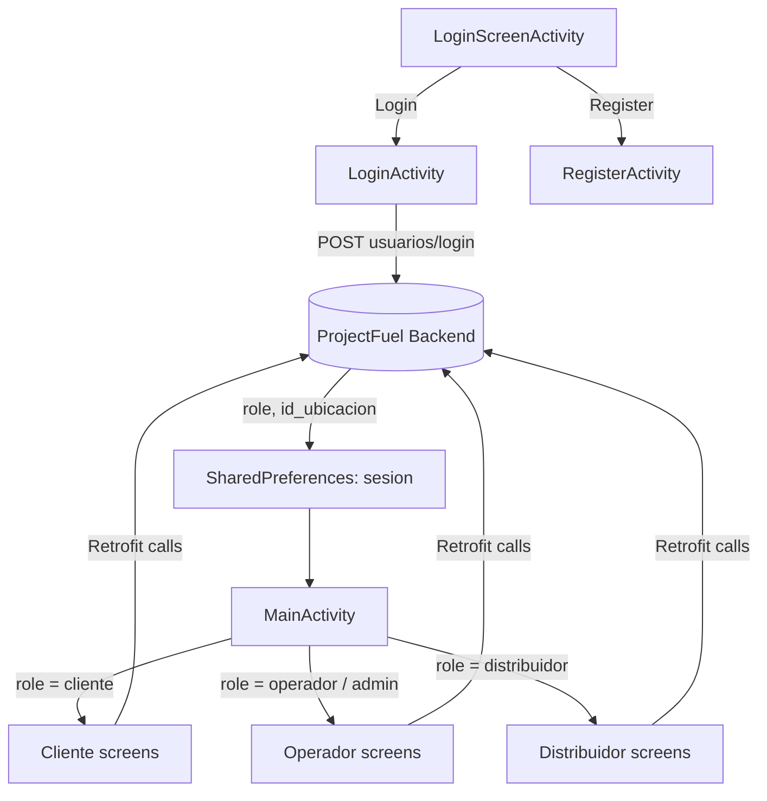

# ProjectFuel Frontend

Native Android client for **ProjectFuel**, a fuel distribution network management platform built for a Universidad Piloto de Colombia software project. The app provides three role-based experiences — customer, station operator, and distributor — over a single codebase, consuming the [ProjectFuel Backend](https://github.com/juandiegogalindo/ProjectFuel-Backend) REST API.


## Table of Contents

- [Overview](#overview)
- [Roles and Features](#roles-and-features)
- [Architecture](#architecture)
- [Technology Stack](#technology-stack)
- [Screen Inventory](#screen-inventory)
- [API Integration](#api-integration)
- [Prerequisites](#prerequisites)
- [Getting Started](#getting-started)
- [Configuration](#configuration)
- [Project Structure](#project-structure)
- [Testing](#testing)
- [Known Limitations](#known-limitations)
- [Roadmap](#roadmap)
- [Contributing](#contributing)
- [License](#license)
- [Author](#author)

## Overview

ProjectFuel Frontend is the mobile face of a fuel supply-chain system: it lets customers find and price fuel, lets station operators run day-to-day inventory and pricing, and lets distributors manage delivery orders and routes. The internal package and app name (`co.edu.unipiloto.scrumbacklog`, `ScrumBacklog`) reflect its origin as a Scrum-based academic project; the domain logic itself is entirely fuel-distribution oriented.

The app does not ship separate builds per role. Instead, `MainActivity` reads the role returned by the backend at login and shows or hides each feature button accordingly, so the same APK serves customers, operators, and distributors.

## Roles and Features

| Role | Capabilities |
|---|---|
| **Cliente** (customer) | Query fuel prices by city/zone (`ConsultaActivity`), check station opening hours (`HorariosActivity`), locate stations on a live map with turn-by-turn route drawing (`MapaEstacionesActivity`), validate subsidy codes (`SubsidioActivity`) |
| **Operador** (station operator) | Register inventory entries and exits (`InventarioActivity`, `SalidasActivity`), receive incoming fuel shipments (`RecepcionCombustibleActivity`), adjust prices by location or zone (`ReguladorPreciosActivity`), schedule new orders (`ProgramarPedidoActivity`), review cancelled orders (`PedidosCanceladosActivity`), check operational history (`HistorialOperadorActivity`), get low-inventory alerts (`NotificadorActivity`) |
| **Distribuidor** (distributor) | Manage distribution inventory (`ControlInventarioActivity`), review pending and to-be-delivered orders (`PedidosPendientesActivity`, `PedidosAEntregarActivity`), track a live delivery route on the map (`RutaDistribucionActivity`), consult delivery history (`HistoricoDistribuidorActivity`), view aggregate order metrics — pending, accepted, delivered, cancelled, total gallons — on a dashboard (`DashboardDistribuidorActivity`) |
| **Admin** | Subset of operator screens (station consultation, inventory, alerts, and inventory control) |

Every screen (except login/register) shares a common `Toolbar` with an info action and a logout action that clears the local session and returns to the login screen.

## Architecture

The app follows a straightforward **Activity-per-screen** structure with no ViewModel/Repository layer: each `Activity` owns its views, calls `ApiService` directly through Retrofit, and updates the UI from the callback. List-based screens use `BaseAdapter` implementations (e.g. `HistoricoAdapter`, `PedidoAdapter`, `MovimientoAdapter`) bound to `ListView`, not `RecyclerView`.



Two screens (`MapaEstacionesActivity`, `RutaDistribucionActivity`) additionally combine `FusedLocationProviderClient` for live GPS tracking with the Google Maps Directions API, decoding the returned polyline with Android Maps Utils to draw routes on the map.

## Technology Stack

| Category | Technology |
|---|---|
| Language | Java 11 |
| Platform | Android, `minSdk` 23, `targetSdk`/`compileSdk` 36 |
| Build | Gradle 9.2.1 (Groovy DSL) with a version catalog (`libs.versions.toml`); Gradle daemon JVM toolchain pinned to JDK 21 |
| Networking | Retrofit 2.11.0 + Gson converter, OkHttp logging interceptor |
| Maps & location | Google Maps SDK for Android, Google Play Services Location, Google Maps Directions API (via Volley), Android Maps Utils |
| UI | AndroidX AppCompat, Material Components, ConstraintLayout, View Binding |
| Local persistence | `SharedPreferences` (session: user id, role, station id) |
| Testing | JUnit 4, AndroidX Test, Espresso (default scaffolding only) |

## Screen Inventory

<details>
<summary>Full list of 21 Activities</summary>

| Package | Activity | Purpose |
|---|---|---|
| `logIn` | `LoginScreenActivity` | App entry point / launcher activity |
| `logIn` | `LoginActivity` | Authenticates and stores session data |
| `logIn` | `RegisterActivity` | Customer self-registration |
| — | `MainActivity` | Role-based navigation hub |
| `cliente` | `ConsultaActivity` | Fuel price lookup by location/zone |
| `cliente` | `HorariosActivity` | Station opening hours |
| `cliente` | `MapaEstacionesActivity` | Station map + route to selected station |
| `cliente` | `SubsidioActivity` | Subsidy code validation |
| `operador` | `InventarioActivity` | Register inventory entries |
| `operador` | `SalidasActivity` | Register inventory exits |
| `operador` | `RecepcionCombustibleActivity` | Receive scheduled fuel shipments |
| `operador` | `ReguladorPreciosActivity` | Adjust prices by location/zone |
| `operador` | `ProgramarPedidoActivity` | Schedule a new order |
| `operador` | `PedidosCanceladosActivity` | Review cancelled orders |
| `operador` | `HistorialOperadorActivity` | Operational movement history |
| `operador` | `NotificadorActivity` | Low-inventory alert check |
| `distribuidor` | `ControlInventarioActivity` | Distribution inventory control |
| `distribuidor` | `PedidosPendientesActivity` | Pending orders queue |
| `distribuidor` | `PedidosAEntregarActivity` | Orders ready for delivery |
| `distribuidor` | `RutaDistribucionActivity` | Live delivery route tracking |
| `distribuidor` | `HistoricoDistribuidorActivity` | Delivery history |
| `distribuidor` | `DashboardDistribuidorActivity` | Order metrics dashboard |

</details>

## API Integration

All backend communication goes through the `ApiService` Retrofit interface. Main endpoint groups consumed:

| Domain | Endpoints |
|---|---|
| Auth | `POST /usuarios/login`, `POST /usuarios/registro` |
| Locations | `GET /ubicaciones`, `GET /ubicaciones/ciudades`, `GET /ubicaciones/zonas/{ciudad}` |
| Prices | `GET/PUT /precios/ubicacion`, `GET/PUT /precios/zona` |
| Inventory | `GET /inventarios/ubicacion/{idUbicacion}` |
| Movements | `POST /movimientos/entrada`, `POST /movimientos/salida`, `GET /movimientos/ubicacion/{idUbicacion}` |
| Orders | `POST /pedidos`, `GET /pedidos`, `GET /pedidos/pendientes(/{idUbicacion})`, `GET /pedidos/aceptados`, `GET /pedidos/cancelados`, `GET /pedidos/entregados/{idUbicacion}`, `PUT /pedidos/{id}/aceptar`, `PUT /pedidos/{id}/cancelar`, `PUT /pedidos/{id}/recibir`, `PUT /pedidos/{id}/entregar`, `GET /pedidos/dashboard/distribuidor` |
| Fuels | `GET /combustibles` |
| Subsidies | `POST /subsidios/validar` |

The Directions endpoint used to draw driving routes (`maps.googleapis.com/maps/api/directions/json`) is called separately via Volley, outside the `ApiService`/Retrofit stack.

## Prerequisites

- Android Studio (Ladybug or newer, to match AGP 9.0.1 / compileSdk 36)
- JDK 21 (Gradle daemon toolchain) — JDK 11 is used only as Java source/target compatibility for the app module
- An Android emulator or physical device, API level 23+
- A running instance of [ProjectFuel Backend](https://github.com/juandiegogalindo/ProjectFuel-Backend) reachable from the device/emulator network
- A Google Maps API key with **Maps SDK for Android** and **Directions API** enabled

## Getting Started

```bash
git clone https://github.com/juandiegogalindo/ProjectFuel-Frontend.git
cd ProjectFuel-Frontend
```

Open the project in Android Studio and let Gradle sync, or build from the command line:

```bash
./gradlew assembleDebug
```

Install on a connected device/emulator:

```bash
./gradlew installDebug
```

## Configuration

Two values must be adjusted before the app is usable against your own environment:

**1. Backend base URL**, hardcoded in `ApiClient.java`:

```java
// app/src/main/java/co/edu/unipiloto/scrumbacklog/api/apiconfiguracion/ApiClient.java
private static final String BASE_URL = "http://192.168.2.10:8080/";
```

Point it to wherever your backend instance runs. For an emulator reaching a backend on the same host machine, `10.0.2.2` is the conventional loopback address instead of `localhost`.

**2. Google Maps API key**, currently duplicated in three places — `res/values/strings.xml`, `AndroidManifest.xml`, and a literal string inside `MapaEstacionesActivity.java`'s Directions request URL. Replace all three with your own key (see [Known Limitations](#known-limitations) for why this should not stay hardcoded).

## Project Structure

```
ProjectFuel-Frontend/
├── app/
│   ├── src/main/java/co/edu/unipiloto/scrumbacklog/
│   │   ├── activity/
│   │   │   ├── logIn/          # LoginScreenActivity, LoginActivity, RegisterActivity
│   │   │   ├── cliente/        # Consulta, Horarios, MapaEstaciones, Subsidio
│   │   │   ├── operador/       # Inventario, Salidas, Notificador, ReguladorPrecios,
│   │   │   │                   # ProgramarPedido, PedidosCancelados,
│   │   │   │                   # RecepcionCombustible, HistorialOperador (+ adapters)
│   │   │   ├── distribuidor/   # ControlInventario, DashboardDistribuidor,
│   │   │   │                   # PedidosPendientes/AEntregar, RutaDistribucion,
│   │   │   │                   # Historico (+ adapters)
│   │   │   └── MainActivity.java   # Role-based navigation hub
│   │   ├── api/
│   │   │   ├── apiconfiguracion/   # ApiClient (Retrofit setup), ApiService (endpoints)
│   │   │   ├── login/               # LoginRequest/Response, RegisterRequest
│   │   │   └── *.java               # Request/Response DTOs (Pedido, Movimiento, Subsidio, ...)
│   │   ├── model/               # Domain models: Usuario, Ubicacion, Pedido, Inventario, ...
│   │   └── Spinner/              # SimpleItemSelected listener helper
│   ├── src/test/                # Unit test scaffolding (JUnit)
│   ├── src/androidTest/         # Instrumented test scaffolding (Espresso)
│   └── src/main/res/
│       ├── layout/               # 21 activity layouts + 8 list-item layouts
│       ├── navigation/           # Unused leftover nav_graph (see Known Limitations)
│       ├── values/               # strings, colors, themes
│       └── xml/                  # network_security_config, backup/data extraction rules
├── gradle/                      # Version catalog and wrapper (Gradle 9.2.1)
└── build.gradle / settings.gradle
```

## Testing

`src/test` and `src/androidTest` currently contain only the default Android Studio example tests (`ExampleUnitTest`, `ExampleInstrumentedTest`) generated when the project was created. Run them with:

```bash
./gradlew test              # JVM unit tests
./gradlew connectedAndroidTest   # Instrumented tests, requires a connected device/emulator
```

No project-specific test currently exercises login, role-based navigation, or API integration — see [Known Limitations](#known-limitations).

## Known Limitations

Documented here for transparency, based on direct code review:

- **Hardcoded secrets:** the Google Maps API key is committed in plain text in three separate places (`strings.xml`, `AndroidManifest.xml`, and inline in `MapaEstacionesActivity.java`). It should live in a non-committed `local.properties`/`BuildConfig` field and be restricted by key constraints in Google Cloud Console.
- **Non-portable backend URL:** `ApiClient.BASE_URL` points to a fixed local IP (`192.168.2.10`), so the app only reaches a backend out of the box on the original developer's LAN. This should move to a build-variant config or a runtime setting.
- **Cleartext HTTP:** the backend is called over `http://`, enabled by a permissive `network_security_config.xml` (`cleartextTrafficPermitted="true"`). Acceptable for local development, not for a real deployment.
- **No token-based session security:** authentication state is a plain `SharedPreferences` entry (`rol`, `id_usuario`, `id_ubicacion`) with no session token, expiration, or server-side re-validation — a locally modified value could escalate role-based UI access, and the backend has no way to reject a stale or tampered client claim.
- **Dead navigation scaffolding:** `res/navigation/nav_graph.xml` still references a `FirstFragment`/`SecondFragment` pair (and matching `fragment_first`/`fragment_second` layouts) from the default Android Studio "Fragment + Navigation" template. Neither fragment class exists in the source tree — the graph, its strings (`first_fragment_label`, `second_fragment_label`, `next`, `previous`) and the `lorem_ipsum` placeholder string are unused leftovers from project bootstrapping and can be deleted along with the `navigation-fragment`/`navigation-ui` dependencies in `app/build.gradle`, since no screen in the app actually uses the Navigation component.
- **List rendering via `BaseAdapter`/`ListView`:** all list-backed screens (order history, movements, pending orders, etc.) use classic `BaseAdapter` + `ListView` rather than `RecyclerView`, which is the current Android recommendation for view recycling performance and animation support.
- **Mixed networking stacks:** most calls go through Retrofit, but the Directions API integration in `MapaEstacionesActivity` and `RutaDistribucionActivity` uses Volley directly, adding a second HTTP client to the dependency graph for a single use case.
- **Minimal automated testing:** see [Testing](#testing).
- **Leftover project identity:** the app name (`ScrumBacklog`) and Java package (`co.edu.unipiloto.scrumbacklog`) still reflect the project's original working title rather than "ProjectFuel," which can be confusing for anyone browsing the source for the first time.

## Roadmap

- [ ] Externalize `BASE_URL` and the Google Maps API key via `BuildConfig`/`local.properties`
- [ ] Add JWT-based session handling with token expiration
- [ ] Remove the unused `nav_graph.xml`, its fragments, and the Navigation component dependencies
- [ ] Migrate `ListView`/`BaseAdapter` screens to `RecyclerView`
- [ ] Migrate the Directions API calls to Retrofit for a single networking stack
- [ ] Add unit tests for API DTOs and instrumented tests for role-based navigation
- [ ] Enforce HTTPS and remove the cleartext network security exception

## Contributing

This is an academic project developed for Universidad Piloto de Colombia. Suggestions and feedback are welcome via issues or pull requests.

## License

This project is licensed under the MIT License.

## Author

**Juan Diego Galindo**
GitHub: [@juandiegogalindo](https://github.com/juandiegogalindo)
